# Индивидуальная работа по Веб-программированию
## Инструкция по запуску
__Установите OpenServer__

Установите OpenServer с официального сайта

__Запустите OpenServer__

1. Нажмите на скаченное приложение, в области уведомлений Windows будет иконка с флажком. Нажав на него выберите запустить .

2. Что бы запустить проект через OpenServer сохраните его в папке OSPanel --> domains

__Откройте проект в браузере__

Нажмите на иконку Open Server в области уведомлений, затем  мои проекты и выберите нужный проект.

## Требования

1.  В качестве «исследовательского проекта» в рамках дисциплины «Вебпрограммирование» предлагается разработать веб-приложение (веб-сайт, rest api, мессенджер-бота) средней сложности, содержащее функционал, реализованный на стороне сервера.
2.  Для реализации индивидуального проекта могут быть использованы любые fronend и backend веб-технологии.
3.  Разрешена работа в командах по 2 человека.
4.  Работа должна быть залита на GitHub, а ссылка прикреплена на Moodle.
5.  Индивидуальная работа должна быть представлена преподавателю и коллегам.

##  Описание лабораторной работы
В данной индивидуальной работе, я разработала веб приложение, темой которой является онлайн система заказа еды.

## Функциональные возможности (для всех)

1. Главная страница  

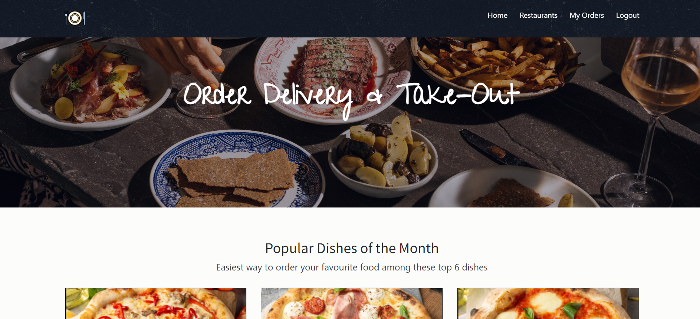

2. Страница с просмотром ресторанов

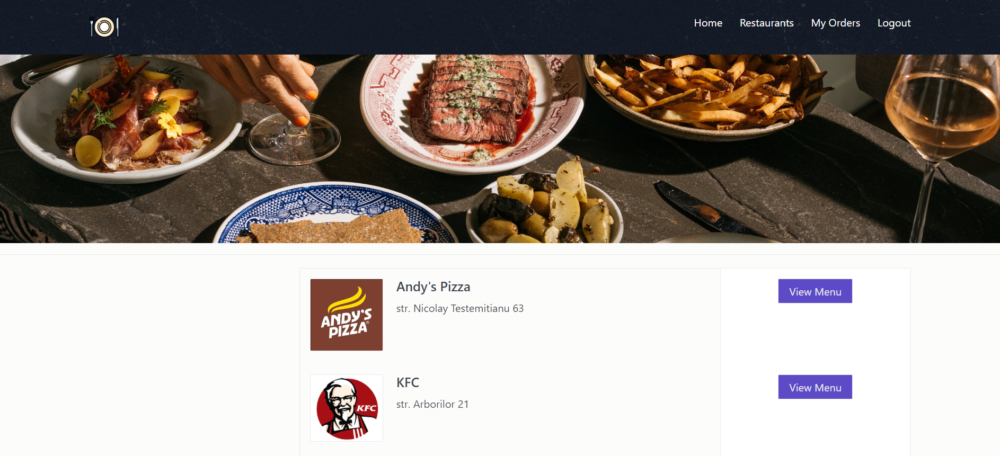

3. Просмотр блюд выбранного ресторана

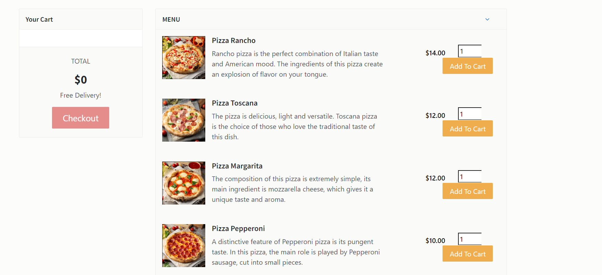

4. Просмотр ресторанов по категориям

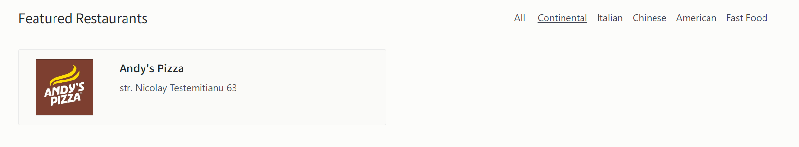

## Функциональные возможности (для пользователей, клиентов)

1. Регистрация нового пользователя 

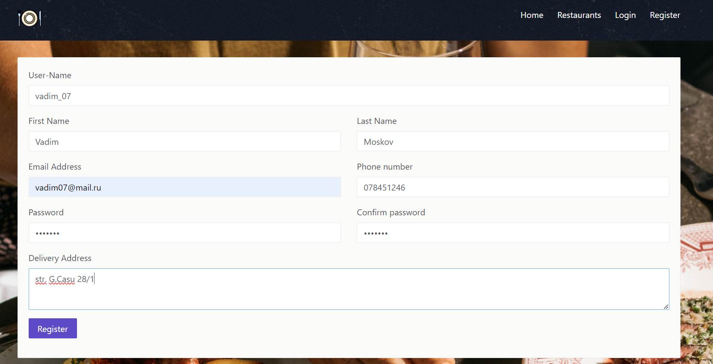

Проверка в БД
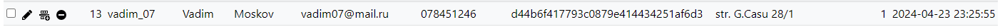

2. Вход в учётную запись

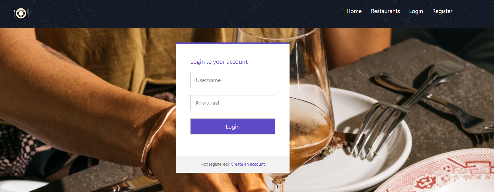

3. Добавление заказа в корзину

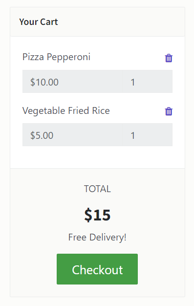

4. ОФормление заказа

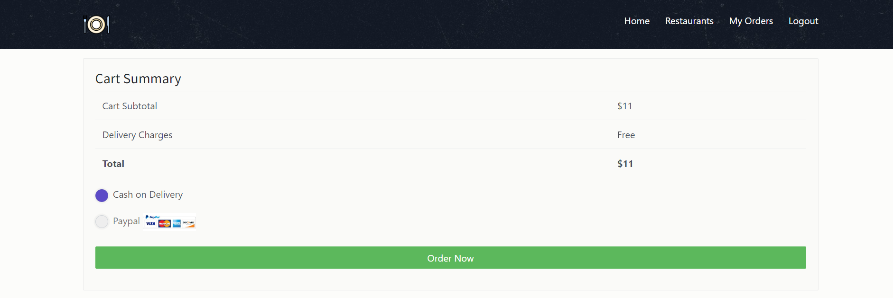

5. Просмотр всех сделанных заказов 

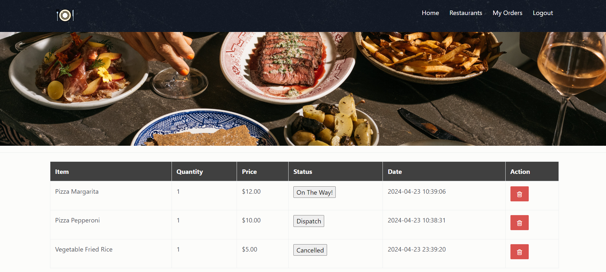

6. Выход из учётной записи

## Функциональные возможности (для администратора)

1. Аутентификация администратора

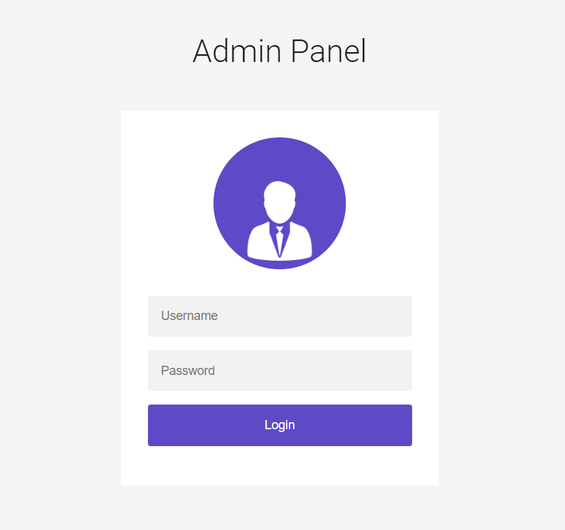

2. Общая панель на главной странице

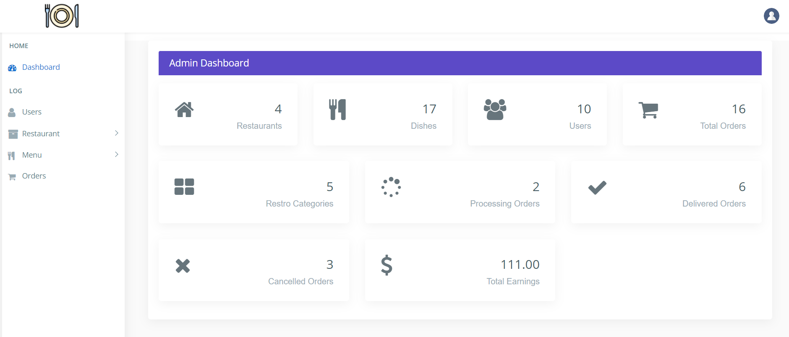

3. Просмотр информации о пользователях 

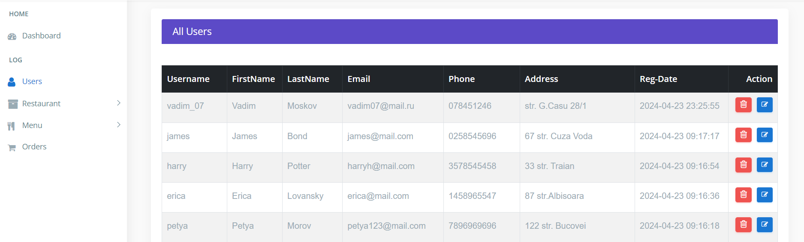

4. Редактирование информации о пользователе

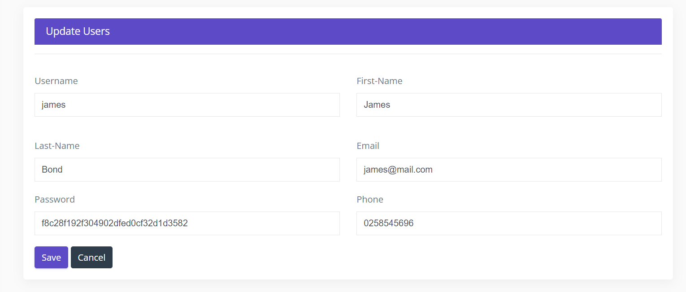

5. Просмотр ресторанов

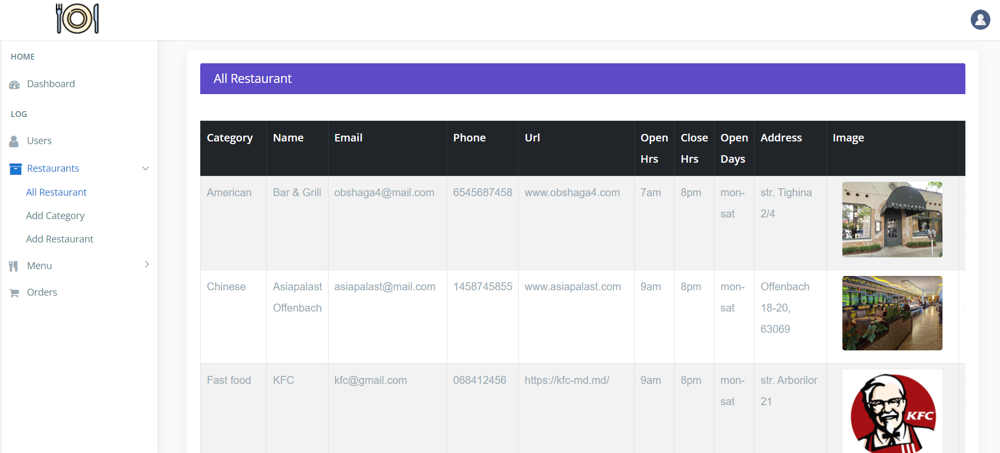

6. Редактирование информации о ресторане

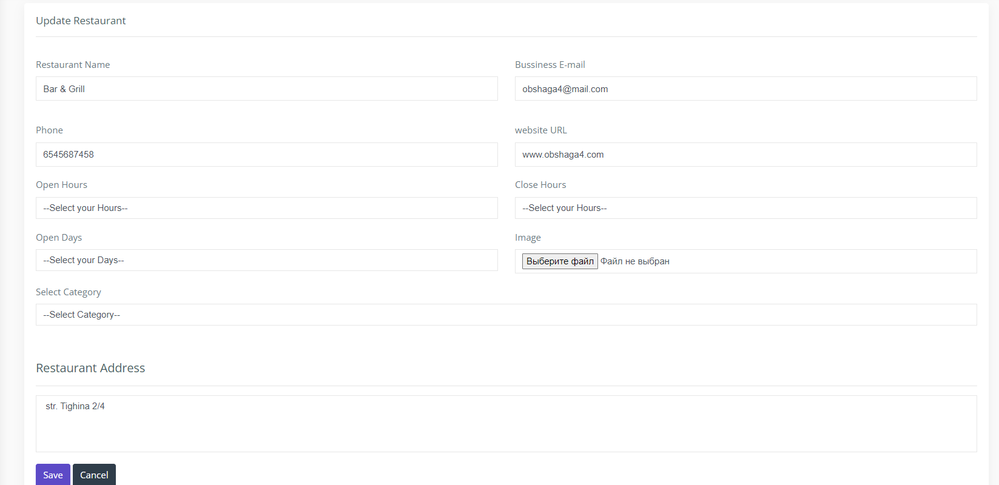

7. Добавление, просмотр и редактирование категорий ресторанов

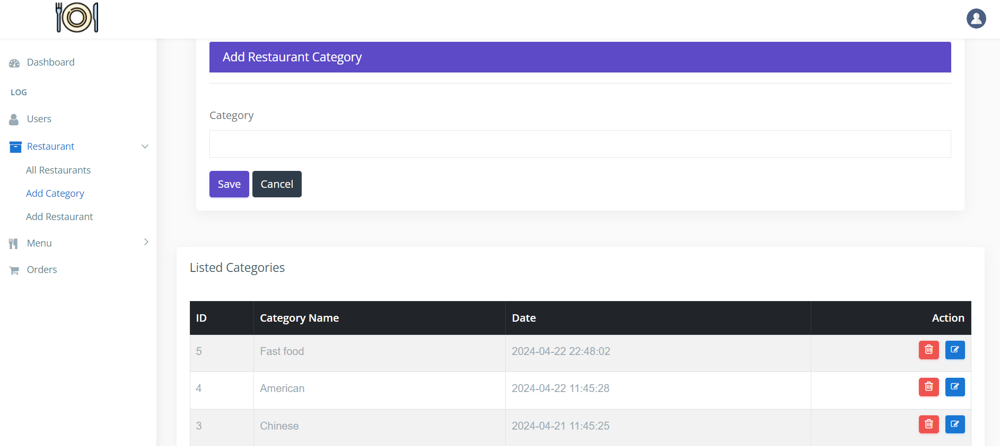

8. Добавление новых ресторанов

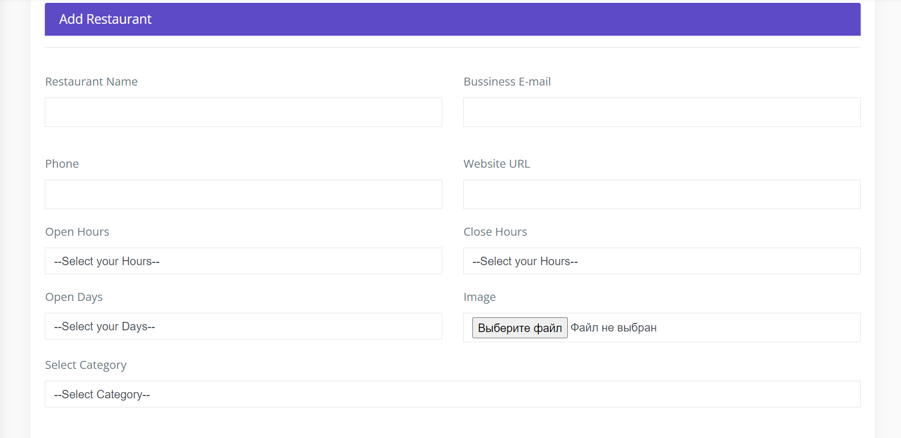

9. Просмотр общего списка блюд

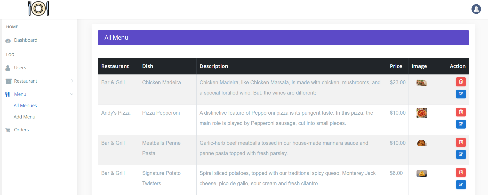

10. Добавление новых блюд

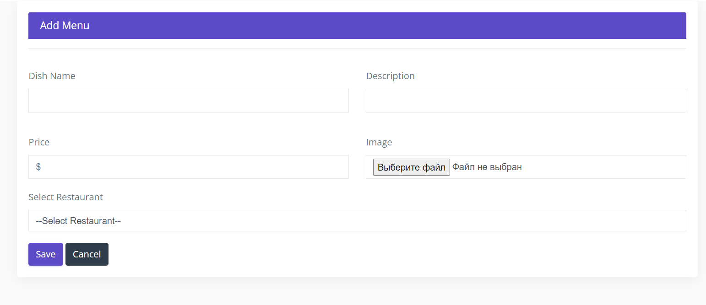

11. Просмотр данных о заказах

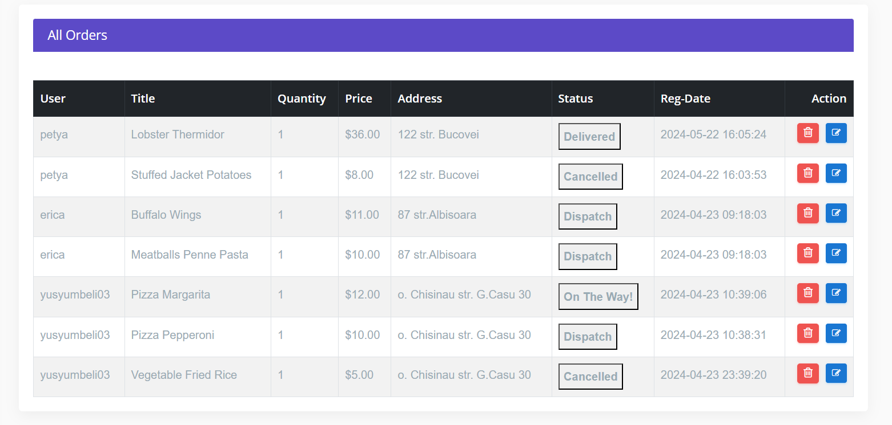

12. Просмотр одного заказа

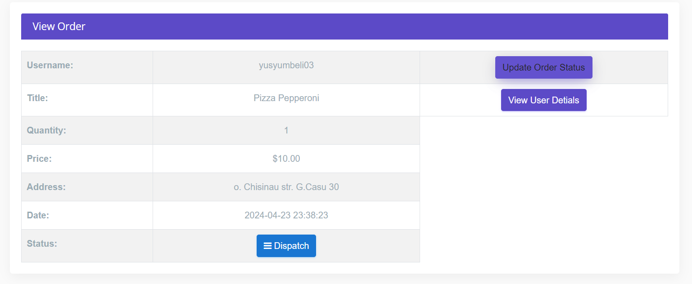
 
13. Просмотр данных заказчика и смена статуса заказа

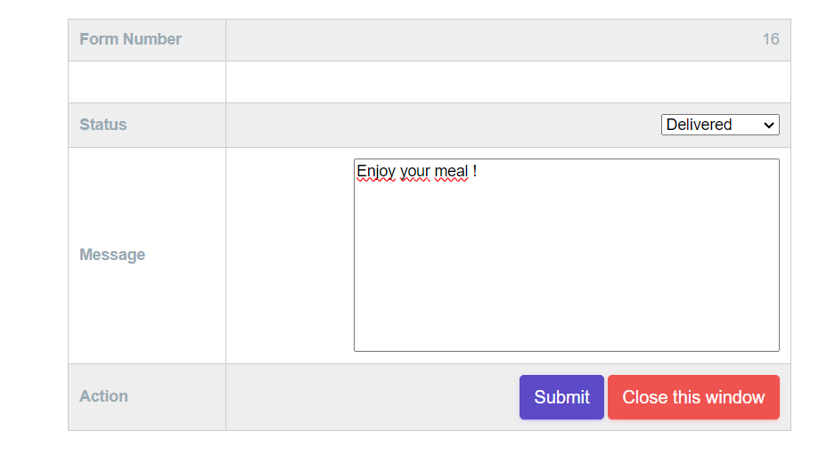

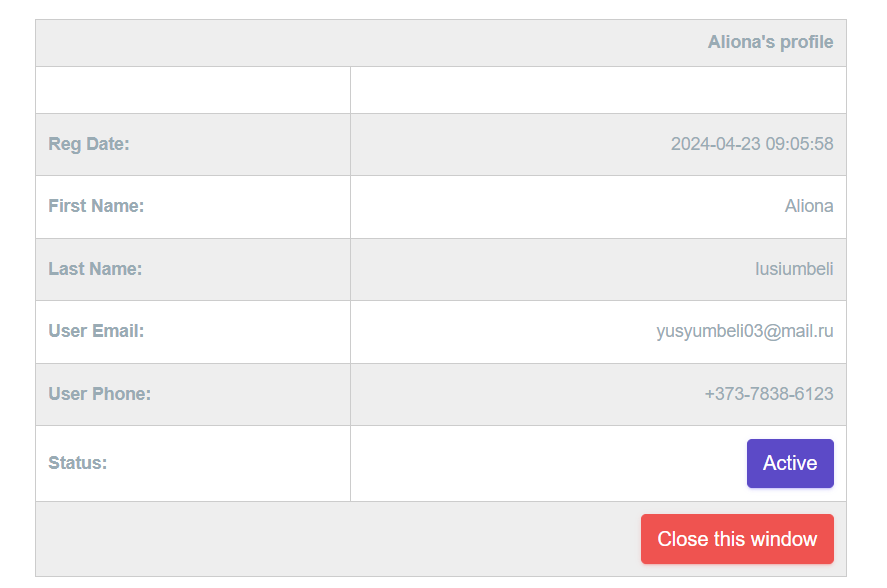

14. Выход из учётной записи

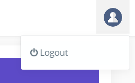

## Структура БД
База данных `onlinefoodphp` состоит из 7 таблиц:
1. admin - информация об админе
2. users - информация о пользователях
3. users_orders - информация о заказах
4. restaurant - информация о ресторанах
5. res_category - информация о категориях ресторанов
6. dishes - информация о блюдах
7. remark - информация о состояниях отправки заказов

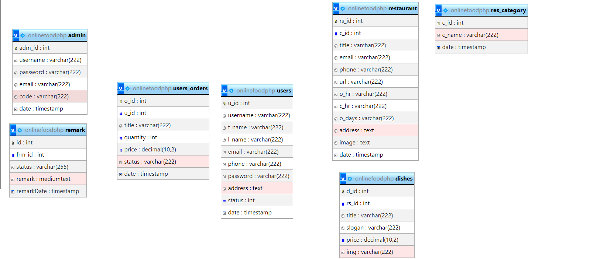

## Список используемых источников

1. https://www.php.net/
2. https://getbootstrap.com/
3. https://chat.openai.com/